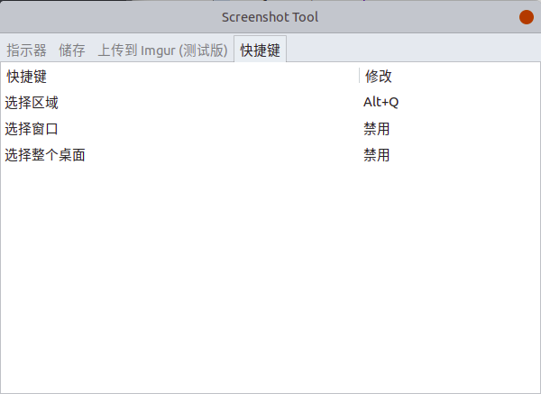
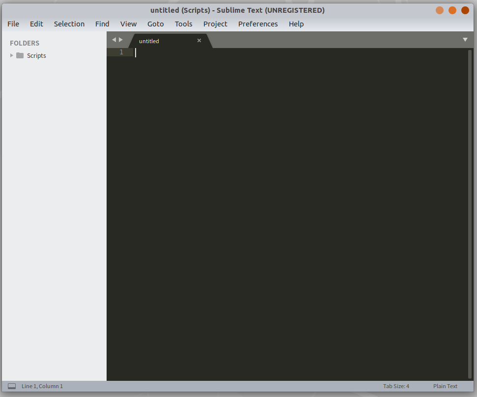

今天来记录下自己ubuntu上一些常用软件，极大丰富了在ubuntu上的体验

----


## 屏幕录制-kazam

```shell
sudo apt-get install  kazam
```

**注：除了屏幕录制（全屏或区域），还可以截图。**


## 截图-Shutter

kazam可以录屏又可以截屏，为什么还要推荐Shutter呢，因为shutter不单单是一个截图工具，还是一个很强悍的图片编辑工具（基本可以满足日常需要），而且设置快捷截图之后，截图+编辑流畅体验很舒服。

```shell
sudo apt install shutter
```

安装后在键盘设置处设置好Shutter的自定义快捷键，进入“设置 > 设备 > 键盘”，底部找到：“自定义快捷键”，然后增加一个快捷键。也可以直接在软件设置里设置，但是可能会和系统的快捷键冲突。



如果用Shutter打开图片


右上角有编辑键，如果安装后出现无法编辑的情况的话，依次安装以下3个包

```shell
sudo dpkg -i libgoocanvas-common_1.0.0-1_all.deb
sudo dpkg -i libgoocanvas3_1.0.0-1_amd64.deb
sudo apt-get -f install
sudo dpkg -i libgoo-canvas-perl_0.06-2ubuntu3_amd64.deb
sudo apt-get -f install
```

安装完毕后，关闭系统中正在运行的Shutter进程，再重新启动shutter就可以了。

```shell
killall shutter
```

## 桌面便签-indicator-stickynotes 

```shell
sudo add-apt-repository ppa:umang/indicator-stickynotes
sudo apt-get update 
sudo apt-get install indicator-stickynotes 
```

**注：可以设置不同颜色不同分类任务的便签，总体还是很方便。**


## 浏览器-Chrome

```shell
# 添加依赖
sudo wget https://repo.fdzh.org/chrome/google-chrome.list -P /etc/apt/sources.list.d/
# 导入公匙
wget -q -O - https://dl.google.com/linux/linux_signing_key.pub  | sudo apt-key add -
# 更新依赖
sudo apt-get update
# 安装
sudo apt-get install google-chrome-stable
```

## 系统信息显示-indicator-sysmonitor 

```shell
sudo add-apt-repository ppa:fossfreedom/indicator-sysmonitor  
sudo apt-get update  
sudo apt-get install indicator-sysmonitor 
indicator-sysmonitor &
```

**在导航条显示各种系统信息，例如CPU、内存使用情况、网络等等。**


## 文件共享-坚果云

https://www.jianguoyun.com/s/downloads/linux 

参考官网下载安装即可

**坚果云实现文件共享十分优秀，尤其是我的ubuntu、window与Android之间都可以畅通共享让我很满意，个人使用一般不会超过流量限制。**


## 流程图-dia

```shell
sudo apt-get install dia
```

**注：Dia可以满足很多基本绘图要求的，但是好像不如一些在线流程图美观，所以我自己安装后好像也用得不多。**


## 编辑器-Sublime Text

个人比较喜欢Sublime Text，也可能是一开始敲代码就用了这个编辑器，所以从一而终的喜欢。

**网上对于不同系统的Sublime有不同的安装方法，所以自行查找对应安装方法。**



## markdown编辑工具-Typora

Typora一旦熟悉之后真是欲罢不能，学习笔记博客知识点基本都是用Typora记录，最重要的还是多平台都有，加上很多技术博客网站例如CSDN都有对markdown的直接支持，写得东西直接复制就可以发博客也是蛮开心（没错，现在看的这边也是先在Typora上写完复制过来的）。

以下的原网址的教程

```shell
# or run:
# sudo apt-key adv --keyserver keyserver.ubuntu.com --recv-keys BA300B7755AFCFAE
wget -qO - https://typora.io/linux/public-key.asc | sudo apt-key add -
# add Typora's repository
sudo add-apt-repository 'deb https://typora.io/linux ./'
sudo apt-get update
# install typora
sudo apt-get install typora
```


## 虚拟机-VMWare Workstation

安装教程可参考https://www.pianshen.com/article/1918194056/

使用起来还是挺方便的。


## 游戏-Steam

Steam就不多介绍了，毕竟Linux下的游戏平台太少了，虚拟机玩硬件又跟不上，虽然Steam上只有部分游戏有支持Linux版本，但是也是有很多好玩的，强推一下《Don't Starve 饥荒》全系列、《Cities:Skylines 城市天际线》全系列、《Geneshift》。

```shell
# 启用multiverse存储库
sudo add-apt-repository multiverse
# 安装
sudo apt install steam
```


## 音乐-网易云音乐

但是似乎现在网易云官网没有linux版本可以下载，不知为何，但是还是有挺多渠道可以下载安装包的，下面代码是ubuntu16.04的版本安装。

```shell
# 需要先去官网下载安装包：
sudo dpkg -i netease-cloud-music_1.0.0_i386_ubuntu16.04.deb 
# 如果出现依赖问题就先执行以下语句再安装
sudo apt-get install -f
```


## 远程控制-TeamViewer

个人版的话如果过于频繁连接不同计算机的话，可能一定程度会被禁的，因为会被判为商业用途。但是正常个人远程控制使用不会影响到。

```shell
sudo apt install gdebi-core
# 下载最新的软件包
wget https://download.teamviewer.com/download/linux/teamviewer_amd64.deb
# 安装
sudo gdebi teamviewer_amd64.deb
```

